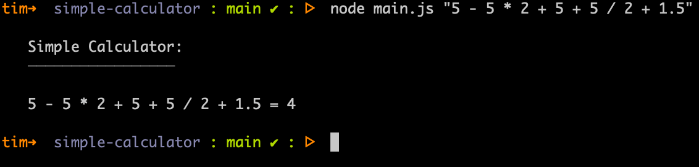
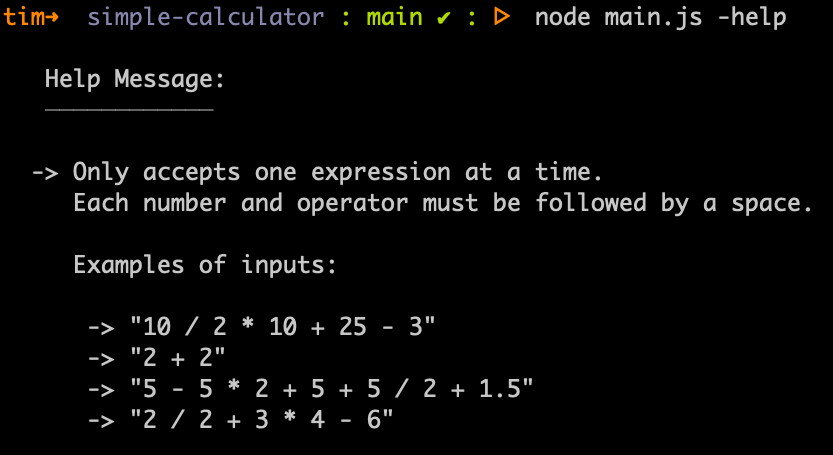
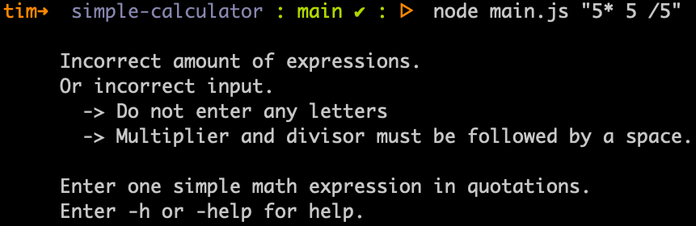

# simple-calculator

### About

A simple calculator Node app. When given a string with basic math operators and numbers separated by spaces, the app will return the value of that expression.

### How To Execute

1. `fork`
2. `clone`
3. Go to the file path where the app is located
4. Run the `node` command followed by a simple math expression

##### Examples of valid expressions:

```
"10 / 2 * 10 + 25 - 3"

"2 / 2 + 3 * 4 - 6"
```

#### Input

```bash
simple-calculator:~ node main.js "5 - 5 * 2 + 5 + 5 / 2 + 1.5"
```

#### Output

```

Simple Calculator:
─────────────────

5 - 5 * 2 + 5 + 5 / 2 + 1.5 = 4

```

### What else does it do?

* Gives "Help" information if user enters -h or -help
* Error message appears if no input are entered
* Error message appears if too many inputs are entered
* Error message appears if letters are entered
* Error message appears if no spaces were added after multiplier and divisor opeartors

### Images of the App

##### Valid expression:



##### Help Message:



##### Invalid expression:



##### Invalid amount of inputs:


### Inspiration

[Codewars - Calculator](https://www.codewars.com/kata/5235c913397cbf2508000048)
